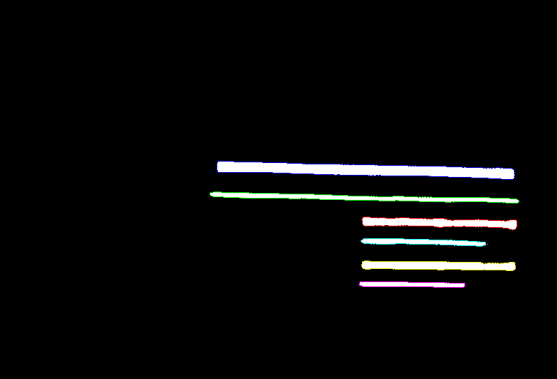

# Boundary tracing
Scratch implementation of [Moore boundary tracing](https://www.imageprocessingplace.com/downloads_V3/root_downloads/tutorials/contour_tracing_Abeer_George_Ghuneim/moore.html) in C++.

## Install library
Although the algorithm is written from scratch, for loading and visualizing images, we use OpenCV.
```
sudo apt install -y libopencv-dev
```

## Usage
Build
```
cmae -S . -B build
cmake --build build
```
Run
```
./build/main
```

## Results


